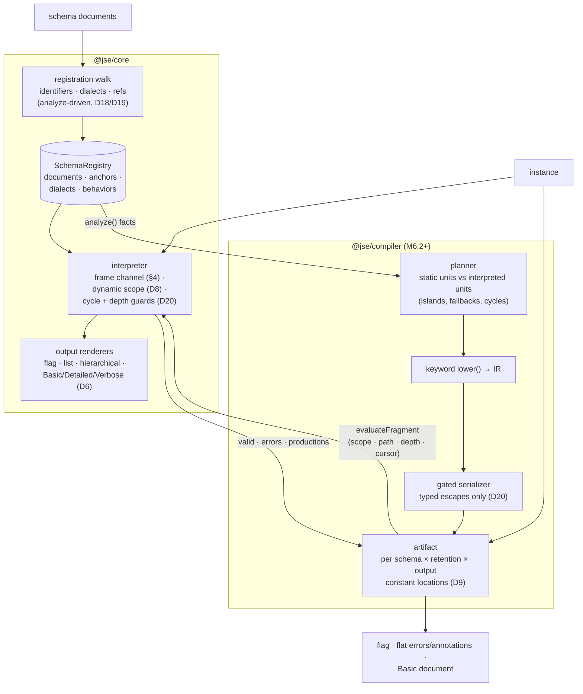

# Architecture

Maintainer-facing overview of how the engine is put together. The decision
record behind each element is [DESIGN.md](../DESIGN.md); the market and
architecture analysis is [ANALYSIS.md](../ANALYSIS.md). This page describes
the system as built through M6.1 (compiler contracts); the compiler tier
itself lands across M6.2–M6.5.

## Two tiers, one keyword registry

The engine is an annotation-first, two-tier design (D1). The interpreter in
`@jse/core` is the reference semantics: spec-faithful, CSP-safe (no code
generation anywhere in its dependency graph), covering all four built-in
dialects and every output format. The compiler in `@jse/compiler` emits
specialized JavaScript for the static parts of a schema and falls back to
the interpreter — through one trampoline — for everything else.

Both tiers share a single source of keyword knowledge: the keyword behavior
registered by URI in the dialect registry (D2). A behavior contributes up to
three views of one semantic:

- `analyze(value, context?)` — static facts: subschema positions, reference
  URIs, regex values, channel produces/consumes, evaluated-coverage
  contributions, application edges (D9a).
- `evaluate(value, cursor, ctx)` — interpreter semantics.
- `lower(value, lctx)` — optional compiled form, expressed as IR through a
  `LoweringContext`, never as JavaScript text. A keyword without `lower()`
  makes its schema object an interpreted unit — a fallback, not a failure.

The compiler consumes only `analyze()` facts and `lower()` IR (D1). It never
dispatches on keyword names, which is what prevents the two tiers from
drifting apart semantically.

## Pipeline

## The channel

Annotation flow is a frame-scoped production channel (DESIGN §4, normative;
implemented once, in `engine.ts`). Each schema application pushes a frame;
keywords produce into it; the frame merges into its parent on success and is
discarded on failure. Consumers (`unevaluatedProperties`/`unevaluatedItems`)
see the current frame filtered by cursor identity. Retention policy filters
only the final result — never consumer visibility — and produce-time elision
(D5) drops productions that are provably neither consumed nor retainable.

## Dynamic scope and islands

`$dynamicRef` resolution (D8) walks a stack of entered schema resources,
outermost first. In compiled artifacts, everything whose evaluation depends
on dynamic state — plus any unit the planner cannot or chooses not to
compile — becomes an _interpreted unit_: compiled code calls
`evaluateFragment` with its constant dynamic-scope contribution, evaluation
path prefix, consumed depth budget, and the instance cursor, and harvests
`{valid, errors, productions}` back. The trampoline is one-way: interpreted
code never re-enters compiled code. That invariant is what makes the channel
analysis of compiled units tractable (an island can only feed its compiled
_ancestors_, never siblings), and it is recorded as a revisit trigger in
DESIGN.md should island-internal recompilation ever be attempted.

## Security posture

The interpreter's resource bounds (ReDoS hooks, uniqueItems hashing, depth
bounds) are D20; see [the security guide](guide/security.md). The compiler
adds the code-generation surface: schema-derived data reaches emitted source
only through the serializer's typed escapes (no raw-code IR node exists),
`new Function` is confined to one module serving the runtime mode (D10), and
standalone emission is the CSP-safe build-time alternative. An adversarial
injection corpus — separate from differential fuzzing, which cannot see
emission-time attacks — gates every compiler milestone.

## Source positions

Loaders may report `getRange` (D17); the registry maps canonical schema
locations back through resource → document pointer tables, so diagnostics
can carry line/column ranges at zero hot-path cost. Compiled artifacts are
unaffected: locations are compile-time constants and correlation stays
post-hoc.
